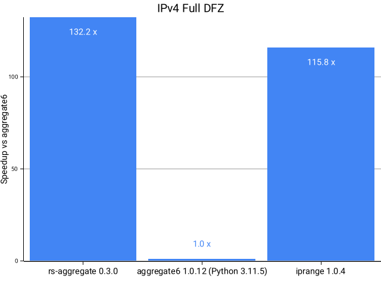

# rs-aggregate
rs-aggregate will aggregate an unsorted list of IP prefixes

Intended to be a drop-in replacement for [aggregate6](https://github.com/job/aggregate6) with better performance.

Takes a list of whitespace-separated IPs or IP networks and aggregates them to their minimal representation.

## Installation

`rs-aggregate` is built statically. CI-built binaries can be found in the GitHub
releases for most common platforms. Simply download the appropriate binary and
place it in your path.

It can also be installed via some software management tools:

### FreeBSD
```
pkg install rs-aggregate
```

### Cargo
```
cargo install rs-aggregate
```


## Known differences from `aggregate6`

* `-m/--max-prefixlen` supports different maximums for each address family as
  ipv4,ipv6 format. A single value is also supported and has the same behaviour
  as `aggregate6` (apply the same maximum to both address families).
* `-v` verbose dump is not supported
* Truncation errors (when host bits are set without the `-t` flag) are printed
  based on the parsed address, ie. always in CIDR format, whereas `aggregate6`
  prints errors based on the input.

## Performance

Performance comparison of `rs-aggregate` vs `aggregate6`. A speedup of >100x is achieved on DFZ data.

### Full DFZ (1154968 total, 202729 aggregates):


### IPv4 DFZ (968520 total, 154061 aggregates):


### 1024 random prefixes (startup time):
